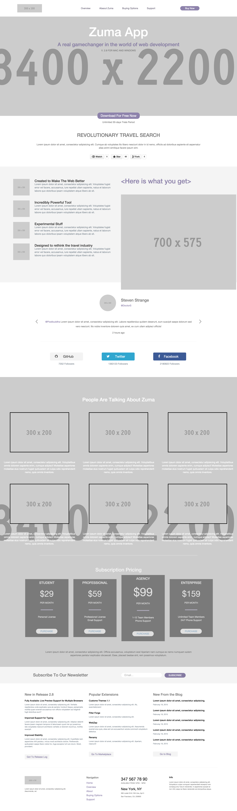

# ZUMATA Practical

[GitHub Repo: ZUMA App](https://github.com/li-xinyang/AW_ZUMATA)

### Task

This is an assessment of your practical front-end development skills. Your task is to develop a simple one-page website layout based upon this mockup. You may download the psd files here.

### Rules

You need to:

- be able to discuss how you designed the page
- be able to discuss why you chose the libraries and/or frameworks (if any)
- not spend a single cent on this

Apart from that, you may use any open source library and/or framework for either front-end or back-end code.

Your project does not have to be a pixel-perfect replication of the mock-up. Try to limit your efforts to approximately 3 hours or below. The amount of time taken will be recorded.

Once you're done, simply zip up the files and upload the archive below.

#### Screenshot

